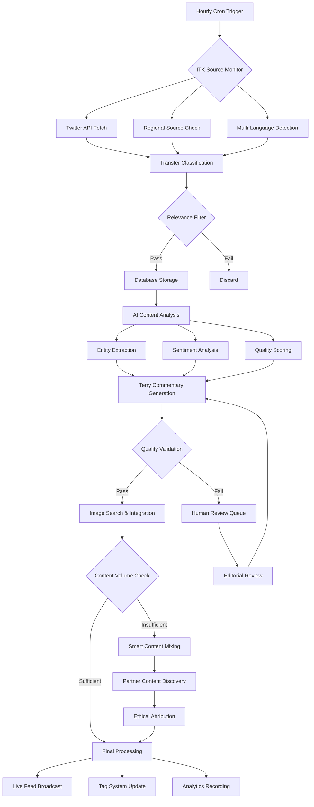

# Transfer Juice Data Pipeline Architecture

## Overview

Transfer Juice operates on a sophisticated real-time data processing pipeline that transforms global ITK (In The Know) sources into engaging, Terry-style commentary. The system is designed for **continuous content flow** rather than batch processing, ensuring addictive feed experiences for users.

## Core Architecture Principles

- **Feed-First Design**: Real-time updates prioritizing continuous engagement
- **Global Scope**: Multi-league, multi-region transfer monitoring
- **Quality-Driven**: Multiple validation layers with human review triggers
- **Modular Components**: Independent, testable processing stages
- **Performance Optimized**: Parallel processing with intelligent caching

## Pipeline Flow Diagram



## Data Flow Stages

### 1. Source Monitoring (`/src/lib/monitoring/hourlyMonitor.ts`)

**Purpose**: Continuous global ITK source monitoring
**Frequency**: Every hour
**Scope**: Worldwide football transfer sources

```typescript
interface ITKMonitoring {
  globalSources: {
    tier1: ['FabrizioRomano', 'David_Ornstein', 'Gianluca_DiMarzio']
    tier2: ['Marca', 'AS_English', 'lequipe', 'SkySportsNews']
    regional: ['ESPNBrasil', 'SkySportDE', 'CalcioMercato']
  }
  multiLanguageDetection: {
    english: ['signing', 'deal', 'medical', 'personal terms']
    spanish: ['fichaje', 'traspaso', 'acuerdo', 'cesión']
    italian: ['trasferimento', 'cessione', 'prestito']
    french: ['transfert', 'prêt', 'rachat', 'signature']
    german: ['Wechsel', 'Transfer', 'Leihe', 'Verpflichtung']
  }
  sourceReliability: {
    historicalAccuracy: number
    tierBasedWeighting: number
    regionalExpertise: boolean
  }
}
```

### 2. Content Classification (`/src/lib/ai/content-analyzer.ts`)

**Purpose**: AI-powered transfer relevance detection
**Processing Time**: <10 seconds per tweet
**Accuracy Target**: >85% classification accuracy

```typescript
interface ContentClassification {
  transferTypes: ['RUMOUR', 'TALKS', 'ADVANCED', 'MEDICAL', 'CONFIRMED', 'OFFICIAL']
  priorityLevels: ['LOW', 'MEDIUM', 'HIGH', 'URGENT']
  entityExtraction: {
    players: PlayerEntity[]
    clubs: ClubEntity[]
    transferDetails: TransferDetail[]
    agents: AgentEntity[]
  }
  sentimentAnalysis: {
    sentiment: 'positive' | 'negative' | 'neutral'
    emotions: ['excitement', 'skepticism', 'optimism', 'anxiety']
    reliability: number // 0-1 score
    urgency: number // 0-1 score
  }
}
```

### 3. Database Storage (`prisma/schema.prisma`)

**Purpose**: Efficient storage with optimized querying
**Performance**: <100ms for common queries
**Structure**: Feed-first design with proper indexing

```sql
-- Key database models
FeedItem: Content with Terry commentary
ITKSource: Global source management
Tag: Three-tag system (#Club, @Player, Source)
EmailSubscriber: User preference management
AnalyticsEvent: Performance tracking
```

### 4. Terry Commentary Generation (`/src/lib/ai/article-generator.ts`)

**Purpose**: Transform raw ITK into engaging Terry-style content
**Voice Consistency**: >90% Terry score threshold
**Processing**: Parallel generation with context memory

```typescript
interface TerryGeneration {
  styleCharacteristics: {
    acerbic: boolean
    parentheticalAsides: boolean
    specificAbsurdDetails: boolean
    weaponisedIrritation: boolean
    emotionalIntelligence: boolean
  }
  contentTypes: {
    microUpdates: '150-300 words max'
    contextAware: 'References previous commentary'
    realTimeReaction: 'Immediate response style'
    escalatingExcitement: 'Major transfer build-up'
  }
  qualityGates: {
    voiceConsistency: '>90% scoring threshold'
    factualAccuracy: '>85% validation'
    brandCompliance: 'Joel Golby style adherence'
  }
}
```

### 5. Quality Validation (`/src/lib/ai/quality-validator.ts`)

**Purpose**: Multi-layered content validation
**Validation Types**: Factual, Brand Voice, Safety, Legal, Editorial, Accessibility
**Human Review**: Triggered for content below thresholds

```typescript
interface QualityValidation {
  automatedChecks: {
    factualAccuracy: '>85% threshold'
    brandVoice: '>80% threshold'  
    contentSafety: '>95% threshold'
    legalCompliance: '>90% threshold'
  }
  humanReviewTriggers: {
    qualityScore: '<85% overall'
    criticalIssues: 'Any critical severity'
    voiceInconsistency: '<75% Terry score'
  }
  validationTime: '<30 seconds per article'
}
```

### 6. Smart Content Mixing (`/src/lib/partnerships/smartMixingOrchestrator.ts`)

**Purpose**: Maintain feed flow during ITK quiet periods
**Trigger**: <3 ITK updates in 2 hours
**Sources**: The Upshot, FourFourTwo, Football Ramble, The Athletic

```typescript
interface ContentMixing {
  quietPeriodDetection: {
    itkActivityThreshold: '<3 updates in 2 hours'
    triggerContentDiscovery: boolean
    emergencyContentBackup: string[]
  }
  partnerIntegration: {
    theUpshot: 'Player antics and off-pitch drama'
    fourFourTwo: 'Historical chaos and transfer retrospectives'  
    footballRamble: 'Weekly mishaps and comedy gold'
    ethicalAttribution: 'Full credit with traffic-driving backlinks'
  }
  terryIntroduction: {
    naturalSegues: '"Right, while we wait for someone to actually sign something..."'
    contextBridges: 'Between ITK and partner content'
    voiceConsistency: '>90% throughout mixing'
  }
}
```

### 7. Image Integration (`/src/lib/image/processor.ts`)

**Purpose**: Contextual image placement for enhanced engagement
**Sources**: Twitter media, Wikipedia Commons, partner content
**Performance**: Lazy loading with CDN optimization

```typescript
interface ImageProcessing {
  sourcePriority: {
    twitterMedia: 'Direct from tweets'
    wikipediaCommons: 'Player/club images'
    partnerContent: 'Attributed source images'
  }
  processing: {
    autoResize: 'Multiple device formats'
    altTextGeneration: 'AI-powered accessibility'
    compressionOptimization: 'Web delivery performance'
    lazyLoading: 'Performance optimization'
  }
  contextualPlacement: {
    aiMatching: '>80% relevance scoring'
    layoutOptimization: 'Reading flow enhancement'
    responsiveDelivery: 'Cross-device compatibility'
  }
}
```

### 8. Live Feed Broadcast (`/src/lib/realtime/broadcaster.ts`)

**Purpose**: Real-time updates without page reloads
**Technology**: WebSocket/SSE for live connections
**Performance**: <5 second update latency

```typescript
interface LiveBroadcast {
  realTimeInfrastructure: {
    websocketConnections: 'Live update streaming'
    serverSentEvents: 'Fallback for compatibility'
    optimisticUI: 'Immediate update display'
    rollbackCapability: 'Error handling'
  }
  feedOptimization: {
    infiniteScroll: 'Performance virtualization'
    tagFiltering: 'Real-time filter application'
    urlStateManagement: 'Shareable filtered views'
    memoryOptimization: '<100MB for 1000+ items'
  }
}
```

## Performance Benchmarks

### Pipeline Performance
- **Source Monitoring**: 20+ global sources checked hourly
- **Classification Accuracy**: >85% transfer relevance detection
- **Processing Speed**: <10 seconds per tweet analysis
- **Quality Validation**: <30 seconds comprehensive checking
- **Live Updates**: <5 seconds ITK to feed appearance

### System Performance
- **Database Queries**: <100ms for common operations
- **Feed Loading**: <3 seconds for 100+ items
- **Real-time Updates**: 99.5%+ WebSocket uptime
- **Memory Usage**: <100MB for 1000+ feed items
- **Filter Performance**: <100ms for any tag combination

### Quality Metrics
- **Terry Voice Consistency**: >90% scoring threshold
- **Factual Accuracy**: >85% validation success
- **Content Safety**: >95% compliance rate
- **Human Review**: <5% content requiring manual review
- **Error Rate**: <1% pipeline failures

## Monitoring & Alerting

### Health Checks
- **Pipeline Execution**: Success/failure rate tracking
- **Source Availability**: ITK source uptime monitoring
- **AI Service Health**: OpenAI API response validation
- **Database Performance**: Query execution time tracking
- **Real-time Connection**: WebSocket stability monitoring

### Alerting Thresholds
- **Pipeline Failure**: >1% error rate in 1 hour
- **Source Downtime**: >20% sources unavailable
- **Quality Degradation**: <80% content passing validation
- **Performance Issues**: >10 second processing times
- **Connection Loss**: >5% WebSocket disconnections

## Configuration Management

### Environment Variables
```bash
# Core Services
DATABASE_URL="postgresql://..."           # Neon PostgreSQL connection
OPENAI_API_KEY="sk-..."                  # AI processing
TWITTER_BEARER_TOKEN="AAAAxxx..."        # ITK source monitoring

# Quality Thresholds
TERRY_VOICE_THRESHOLD="0.90"            # Voice consistency minimum
QUALITY_VALIDATION_THRESHOLD="0.85"      # Overall quality minimum
HUMAN_REVIEW_THRESHOLD="0.75"           # Trigger manual review

# Performance Settings
PROCESSING_TIMEOUT="10000"              # 10 seconds max processing
CACHE_TTL="3600"                        # 1 hour cache duration
WEBSOCKET_HEARTBEAT="30000"             # 30 second ping interval

# Content Mixing
QUIET_PERIOD_THRESHOLD="3"              # Minimum updates before padding
PARTNER_CONTENT_RATIO="0.25"            # Max 25% non-ITK content
ATTRIBUTION_BACKLINK_REQUIRED="true"     # Ethical content attribution
```

### Pipeline Configuration
```typescript
// src/config/pipeline.ts
export const PIPELINE_CONFIG = {
  monitoring: {
    frequency: '0 * * * *', // Every hour
    sources: GLOBAL_ITK_SOURCES,
    timeout: 300000, // 5 minutes max
  },
  processing: {
    aiModel: 'gpt-4.1',
    maxTokens: 4000,
    temperature: 0.7,
    parallelProcessing: true,
  },
  quality: {
    terryMinScore: 90,
    factualMinScore: 85,
    safetyMinScore: 95,
    humanReviewBelow: 75,
  },
  performance: {
    maxProcessingTime: 10000,
    cacheEnabled: true,
    cacheTTL: 3600,
    retryAttempts: 3,
  },
};
```

## Error Handling & Recovery

### Retry Mechanisms
- **API Failures**: Exponential backoff with 3 attempts
- **Database Timeouts**: Connection pooling with failover
- **AI Processing**: Model fallback and cached responses
- **Image Loading**: Progressive enhancement with fallbacks

### Graceful Degradation
- **Source Unavailability**: Continue with available sources
- **AI Service Issues**: Use cached commentary patterns
- **Database Issues**: Queue operations for retry
- **Real-time Failures**: Fall back to polling updates

### Dead Letter Queues
- **Failed Processing**: Queue for manual review
- **Quality Failures**: Human editorial workflow
- **Timeout Issues**: Extended processing queue
- **Critical Errors**: Immediate alerting and escalation

## Testing Strategy

### Unit Testing
- **Individual Components**: 90%+ coverage requirement
- **AI Processing**: Mock responses and validation
- **Database Operations**: Transaction testing
- **Error Scenarios**: Comprehensive failure testing

### Integration Testing
- **End-to-End Pipeline**: Complete flow validation
- **External API Integration**: Real service testing
- **Performance Testing**: Load and stress testing
- **Quality Validation**: Content approval workflows

### Production Testing
- **Smoke Tests**: Post-deployment validation
- **Health Checks**: Continuous monitoring
- **User Experience**: Real user monitoring
- **Performance Regression**: Baseline comparison

## Security & Compliance

### Data Protection
- **Personal Data**: GDPR compliance for subscribers
- **API Security**: Rate limiting and authentication
- **Content Safety**: Automated and manual moderation
- **Legal Compliance**: Defamation and copyright protection

### Infrastructure Security
- **Environment Variables**: Secure secret management
- **Database Access**: Connection encryption and pooling
- **API Keys**: Rotation and monitoring
- **Network Security**: HTTPS and secure connections

## Future Enhancements

### Planned Improvements
1. **Machine Learning**: Quality threshold optimization
2. **Advanced Monitoring**: Predictive alerting systems
3. **Content Partnerships**: Expanded source integration
4. **Performance Optimization**: Further speed improvements

### Scalability Considerations
- **Horizontal Scaling**: Microservice decomposition
- **Caching Strategy**: Multi-layer cache optimization
- **Database Scaling**: Read replicas and sharding
- **Content Delivery**: Global CDN optimization

---

*This architecture documentation provides a comprehensive overview of the Transfer Juice data pipeline. The system is designed for reliability, performance, and maintainability while delivering the engaging Terry-style content that makes transfer news addictive.*